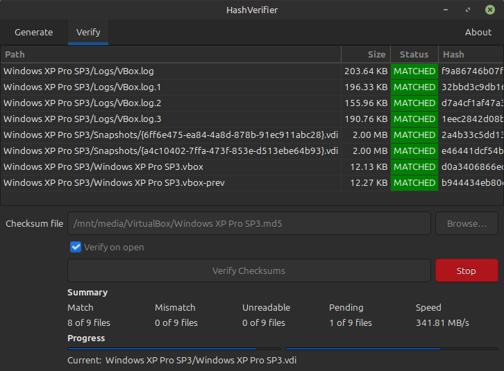

# HashVerifier

A cross-platform checksum generation and verification tool with both CLI and GTK3 graphical interface.



## Features

- **Checksum Generation** — Recursively generate checksum files for entire directories
- **File Verification** — Verify files against existing checksum files
- **Multiple Algorithms** — Support for 11 hash algorithms
- **Dual Interface** — Use via command-line or intuitive GUI
- **Progress Tracking** — Real-time progress for both generation and verification
- **Speed Tracking** — Live hashing speed display
- **Symbolic Link Support** — Follows symbolic links, hard links, and junction points
- **UTF-8 Encoding** — All checksum files are saved in UTF-8 encoding
- **Persistent Settings** — GUI preferences and column order are saved automatically
- **CLI Configuration** — View and edit settings via command line

## Supported Platforms

| Operating System | Architecture | Binary | Package |
|------------------|--------------|--------|---------|
| Linux | x86_64 (amd64) | ✅ | DEB, RPM, AppImage |
| Linux | ARM64 (aarch64) | ✅ | DEB, RPM |
| Windows | x86_64 (amd64) | ✅ | ZIP |
| Windows | x86 (i686) | ✅ | ZIP |

**Minimum OS versions:**

- **Linux:** Ubuntu 22.04+, Fedora 35+, Debian 12+, RHEL 9+ (GLIBC 2.34+, GTK 3.24+)
- **Windows:** Windows 7 SP1 and later (32-bit and 64-bit)

> **Note for Windows:** Windows binaries run in GUI mode only (no CLI support).

## Supported Hash Algorithms

| Algorithm | Extension | Format |
|-----------|-----------|--------|
| CRC32 | `.sfv` | `filename hash` |
| MD4 | `.md4` | `hash *filename` |
| MD5 | `.md5` | `hash *filename` |
| SHA1 | `.sha1` | `hash *filename` |
| SHA256 | `.sha256` | `hash *filename` |
| SHA384 | `.sha384` | `hash *filename` |
| SHA512 | `.sha512` | `hash *filename` |
| SHA3-256 | `.sha3-256` | `hash *filename` |
| SHA3-384 | `.sha3-384` | `hash *filename` |
| SHA3-512 | `.sha3-512` | `hash *filename` |
| BLAKE3 | `.blake3` | `hash *filename` |

## Installation

### Linux

**DEB (Debian/Ubuntu):**

```bash
sudo apt install ./hashverifier_1.0.0_amd64.deb
```

**RPM (Fedora/RHEL):**

```bash
sudo dnf install ./hashverifier-1.0.0-1.x86_64.rpm
```

**AppImage (Universal Linux):**

```bash
chmod +x HashVerifier-1.0.0-x86_64.AppImage
./HashVerifier-1.0.0-x86_64.AppImage
```

### Windows

Download and extract the ZIP archive for your architecture:

- `hashverifier-vX.X.X-windows-amd64.zip` (64-bit)
- `hashverifier-vX.X.X-windows-i686.zip` (32-bit)

## Usage

### GUI Mode (Default)

```bash
# Launch GUI
./hashverifier

# Open directory (Generate tab)
./hashverifier /path/to/directory

# Open checksum file (Verify tab)
./hashverifier /path/to/checksum.sha256
```

### CLI Mode

**Generate checksums:**

```bash
./hashverifier generate ./data ./data.sha256
./hashverifier generate ./photos ./photos.md5
```

**Verify files:**

```bash
./hashverifier verify ./data.sha256
./hashverifier verify ./archive.md5
```

### Configuration

**View settings:**

```bash
./hashverifier config
./hashverifier config show
```

**Edit settings:**

```bash
./hashverifier config edit
```

Opens the settings file in your default text editor (`$VISUAL` or `$EDITOR`).

**Reset settings:**

```bash
./hashverifier config reset
```

**Settings location:**

| Platform | Path |
|----------|------|
| Linux | `~/.config/hashverifier/settings.yaml` |
| Windows | `%APPDATA%\hashverifier\settings.yaml` |

**Available settings:**

| Setting | Default | Description |
|---------|---------|-------------|
| `window.tab_order` | `generate, verify` | Order of tabs in main window |
| `window.current_page` | `0` | Currently active tab |
| `generate.follow_symbolic_links` | `true` | Follow symbolic links when scanning directories |
| `generate.sort_paths` | `true` | Sort paths before hashing |
| `generate.algorithm` | `.md5` | Default hash algorithm |
| `generate.column_order` | `path, size, hash, note` | Order of columns in Generate tab |
| `generate.sort_column` | `path` | Column to sort by in Generate tab |
| `generate.sort_order` | `asc` | Sort order in Generate tab (asc/desc) |
| `verify.verify_on_open` | `true` | Auto-start verification when opening checksum file |
| `verify.column_order` | `status, path, size, hash, expected_hash, note` | Order of columns in Verify tab |
| `verify.sort_column` | `status` | Column to sort by in Verify tab |
| `verify.sort_order` | `desc` | Sort order in Verify tab (asc/desc) |

### Output Format

**SHA256 example:**

```
; Generated at <timestamp> by HashVerifier <version>

a1b2c3d4e5f6... *documents/report.pdf
f6e5d4c3b2a1... *documents/notes.txt
```

**CRC32/SFV example:**

```
; Generated at <timestamp> by HashVerifier <version>

documents/report.pdf a1b2c3d4
documents/notes.txt f6e5d4c3
```

**Footer with statistics (appended to all checksum files):**

```
; Statistics:
;   Status: success
;   Processed: 2
```

**Status values:**

| Status | Description |
|--------|-------------|
| `success` | All files were hashed successfully |
| `completed with errors` | Some files could not be hashed (e.g., permission denied) |
| `cancelled` | Operation was cancelled by the user |

### Verification Results

| Status | Description |
|--------|-------------|
| `MATCHED` | File hash matches — integrity confirmed |
| `MISMATCH` | File hash differs — file may be corrupted |
| `UNREADABLE` | File could not be read — missing or permission denied |

## Build from Source

See [Development Guide](docs/DEVELOPMENT.md) for build instructions and contribution guidelines.

## Related Projects

HashVerifier was inspired by:

- [HashCheck Shell Extension](https://github.com/gurnec/HashCheck)
- [HashCheck Fork](https://github.com/idrassi/HashCheck)

Unlike these Windows-only tools, HashVerifier is cross-platform.

## License

MIT License — see [LICENSE](LICENSE). Third-party notices in [THIRD_PARTY_NOTICES](THIRD_PARTY_NOTICES).
