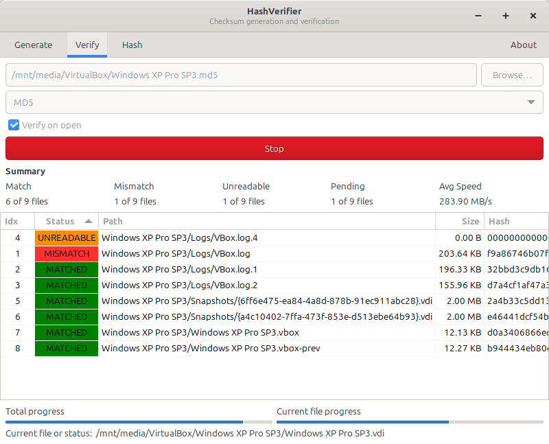

# HashVerifier

A cross-platform checksum generation and verification tool with both CLI and GTK3 graphical interface.



## Features

- **Checksum Generation** — Recursively generate checksum files for entire directories
- **File Verification** — Verify files against existing checksum files
- **Multiple Algorithms** — Support for 11 hash algorithms
- **Dual Interface** — Use via command-line or intuitive GUI
- **Progress Tracking** — Real-time progress for both generation and verification
- **Speed Tracking** — Live hashing speed display
- **Symbolic Link Support** — Follows symbolic links, hard links, and junction points
- **UTF-8 Encoding** — All checksum files are saved in UTF-8 encoding
- **Persistent Settings** — GUI preferences and column order are saved automatically
- **CLI Configuration** — View and edit settings via command line

## Supported Platforms

| Operating System | Architecture | Binary | Package |
|------------------|--------------|--------|---------|
| Linux | x86_64 (amd64) | ✅ | DEB, RPM, AppImage, Flatpak |
| Linux | ARM64 (aarch64) | ✅ | DEB, RPM, AppImage, Flatpak |
| Windows | x86_64 (amd64) | ✅ | ZIP, EXE Installer |
| Windows | x86 (i686) | ✅ | ZIP, EXE Installer |

**Recommended installation:** Flatpak is the recommended installation method for Linux as it provides automatic updates and includes all dependencies.

**Minimum OS versions:**

- **Linux:** Ubuntu 20.04+, Fedora 32+, Debian 11+, RHEL 9+ (GLIBC 2.31+, GTK 3.24+)
- **Windows:** Windows 7 SP1 and later (32-bit and 64-bit)

> **Note for Flatpak:** Minimum requirements depend on the Flatpak runtime version.

> **Note for Windows:** Windows binaries run in GUI mode only (no CLI support).

## Supported Hash Algorithms

| Algorithm | Extension | Format |
|-----------|-----------|--------|
| CRC32 | `.sfv` | `filename hash` |
| MD4 | `.md4` | `hash *filename` |
| MD5 | `.md5` | `hash *filename` |
| SHA1 | `.sha1` | `hash *filename` |
| SHA256 | `.sha256` | `hash *filename` |
| SHA384 | `.sha384` | `hash *filename` |
| SHA512 | `.sha512` | `hash *filename` |
| SHA3-256 | `.sha3-256` | `hash *filename` |
| SHA3-384 | `.sha3-384` | `hash *filename` |
| SHA3-512 | `.sha3-512` | `hash *filename` |
| BLAKE3 | `.blake3` | `hash *filename` |

## Installation

### Linux

**Flatpak (Recommended):**

```bash
flatpak install flathub io.github.ostapkonst.HashVerifier
flatpak run io.github.ostapkonst.HashVerifier
```

> **Flatpak Sandbox Notice:** When running as a Flatpak, the application operates in a sandboxed environment with restricted file system access. By default, only the **Documents** and **Desktop** folders are accessible. To access other locations, use [Flatseal](https://github.com/tchx84/Flatseal) to grant additional permissions manually.

**DEB (Debian/Ubuntu):**

```bash
sudo apt install ./hashverifier_X.X.X_amd64.deb
```

**RPM (Fedora/RHEL):**

```bash
sudo dnf install ./hashverifier-X.X.X-1.x86_64.rpm
```

**AppImage (Universal Linux):**

```bash
chmod +x HashVerifier-X.X.X-x86_64.AppImage
./HashVerifier-X.X.X-x86_64.AppImage
```

### Windows

**Installer (Recommended):**

Download and run the Inno Setup installer for your architecture:

- `hashverifier-X.X.X-windows-amd64.exe` (64-bit)
- `hashverifier-X.X.X-windows-i686.exe` (32-bit)

The installer will:

- Install HashVerifier to your system
- Create Start Menu and optional Desktop shortcuts
- Add "Send To" menu entry for quick access via right-click
- Register checksum file associations (`.sfv`, `.md4`, `.md5`, `.sha1`, `.sha256`, `.sha384`, `.sha512`, `.sha3-256`, `.sha3-384`, `.sha3-512`, `.blake3`)

**Portable ZIP:**

Download and extract the ZIP archive for your architecture:

- `hashverifier-X.X.X-windows-amd64.zip` (64-bit)
- `hashverifier-X.X.X-windows-i686.zip` (32-bit)

## Usage

See [Usage Guide](docs/USAGE.md) for detailed documentation on GUI mode, CLI commands, configuration, and output formats.

## Build from Source

See [Development Guide](docs/DEVELOPMENT.md) for build instructions and contribution guidelines.

## Related Projects

HashVerifier was inspired by:

- [HashCheck Shell Extension](https://github.com/gurnec/HashCheck)
- [HashCheck Fork](https://github.com/idrassi/HashCheck)

Unlike these Windows-only tools, HashVerifier is cross-platform.

## License

MIT License — see [LICENSE](LICENSE). Third-party notices in [THIRD_PARTY_NOTICES](THIRD_PARTY_NOTICES).
